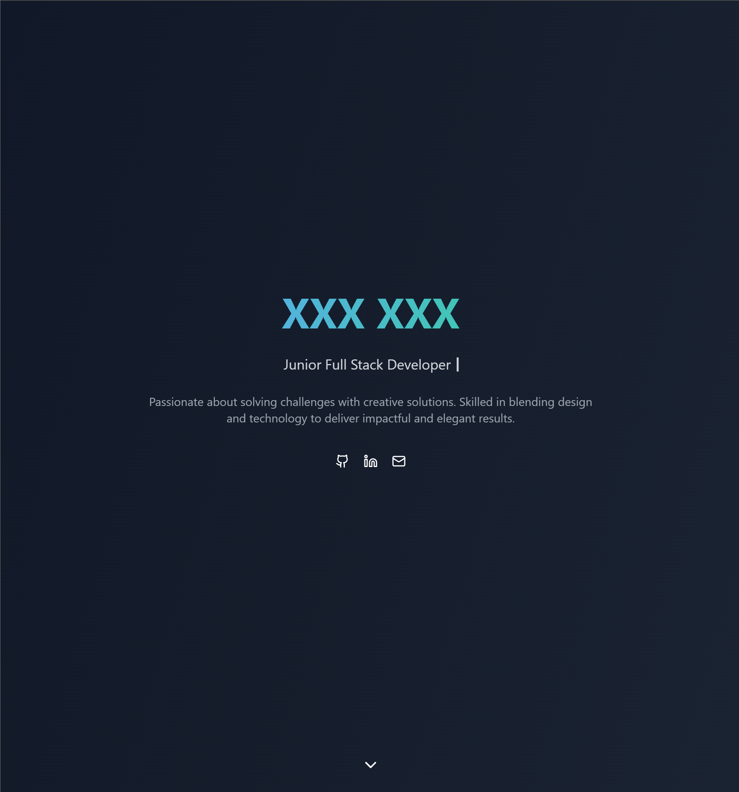
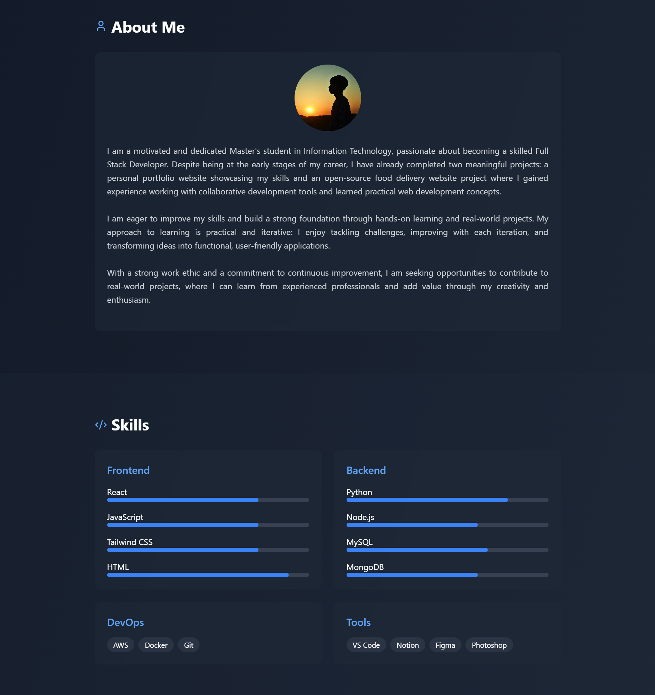

# Personal Portfolio Website




Welcome to my personal portfolio website! This project showcases my skills, experiences, and projects, reflecting my journey and aspirations as a Web Developer.

## Table of Contents
- [Features](#features)
- [Technologies Used](#technologies-used)
- [Setup and Installation](#setup-and-installation)


---

## Features
- **Responsive Design**: Optimized for desktop, tablet, and mobile devices, providing a seamless user experience.
- **Dynamic Typing Effect**: Showcases an engaging typewriter effect to highlight my role on the homepage.
- **Project Showcase**: Displays my personal and collaborative projects with descriptions and external links.
- **Smooth Scrolling Navigation**: Ensures effortless page navigation for visitors.
- **Social Media Integration**: Includes links to GitHub, LinkedIn, and email for easy communication.

---

## Technologies Used
- **Frontend**:
  - React
  - Tailwind CSS
  - HTML
- **Build Tool**:
  - Vite
- **Version Control**:
  - Git and GitHub

---

## Setup and Installation

1. Clone the repository:
   ```bash
   git clone https://github.com/MingcanYang/Presonal-Portfolio-Web.git

2. Navigate to the project directory:
   ```bash
   cd Presonal-Portfolio-Web

3. Install dependencies:
   ```bash
   npm install

4. Start the development server:
   ```bash
   npm run dev
   
5. Open the project in your browser:
   ```bash
   http://localhost:5173
